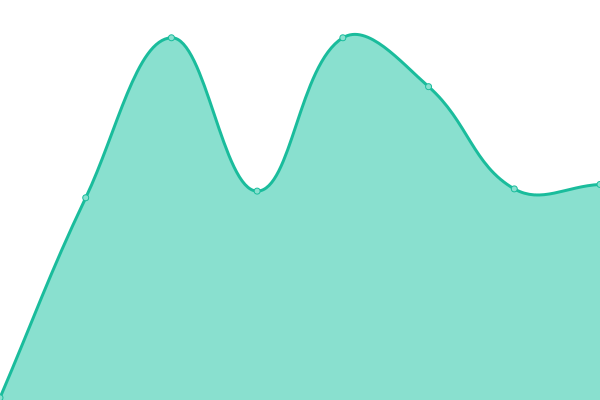

# [📈 Live Status](https://status.cr4.live): <!--live status--> **🟩 All systems operational**

This repository contains the open-source uptime monitor and status page for [SetCr4](cr4.live), powered by [Upptime](https://github.com/upptime/upptime).

With [Upptime](https://upptime.js.org), you can get your own unlimited and free uptime monitor and status page, powered entirely by a GitHub repository. We use [Issues](https://github.com/SetCr4/cr4-upptime/issues) as incident reports, [Actions](https://github.com/SetCr4/cr4-upptime/actions) as uptime monitors, and [Pages](https://status.cr4.live) for the status page.

<!--start: status pages-->
<!-- This summary is generated by Upptime (https://github.com/upptime/upptime) -->
<!-- Do not edit this manually, your changes will be overwritten -->
<!-- prettier-ignore -->
| URL | Status | History | Response Time | Uptime |
| --- | ------ | ------- | ------------- | ------ |
|  [Main Server](89.58.57.232) | 🟩 Up | [main-server.yml](https://github.com/SetCr4/cr4-upptime/commits/HEAD/history/main-server.yml) | 

 110ms
     
 | 

<a href="https://status.cr4.live/history/main-server">100.00%</a>
    

|  [Home Server (Raspi)](pi.cr4.live) | 🟩 Up | [home-server-raspi.yml](https://github.com/SetCr4/cr4-upptime/commits/HEAD/history/home-server-raspi.yml) | 

 170ms
     
 | 

<a href="https://status.cr4.live/history/home-server-raspi">100.00%</a>
    

|  [Moepi vServer](157.90.112.60) | 🟩 Up | [moepi-v-server.yml](https://github.com/SetCr4/cr4-upptime/commits/HEAD/history/moepi-v-server.yml) | 

 110ms
     
 | 

<a href="https://status.cr4.live/history/moepi-v-server">100.00%</a>
    

|  [HypeParty](https://hypeparty.net) | 🟩 Up | [hype-party.yml](https://github.com/SetCr4/cr4-upptime/commits/HEAD/history/hype-party.yml) | 

 729ms
     
 | 

<a href="https://status.cr4.live/history/hype-party">100.00%</a>
    

|  [RoleUpdater](https://api.cr4.live) | 🟩 Up | [role-updater.yml](https://github.com/SetCr4/cr4-upptime/commits/HEAD/history/role-updater.yml) | 

 771ms
     
 | 

<a href="https://status.cr4.live/history/role-updater">100.00%</a>
    

<!--end: status pages-->

[**Visit our status website →**](https://status.cr4.live)

## 📄 License

- Powered by: [Upptime](https://github.com/upptime/upptime)
- Code: [MIT](./LICENSE) © [SetCr4](cr4.live)
- Data in the `./history` directory: [Open Database License](https://opendatacommons.org/licenses/odbl/1-0/)
